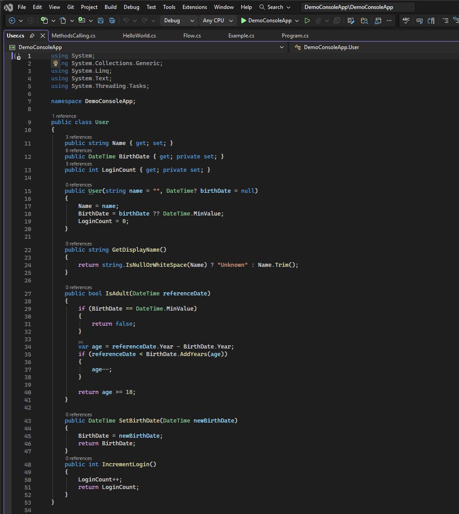
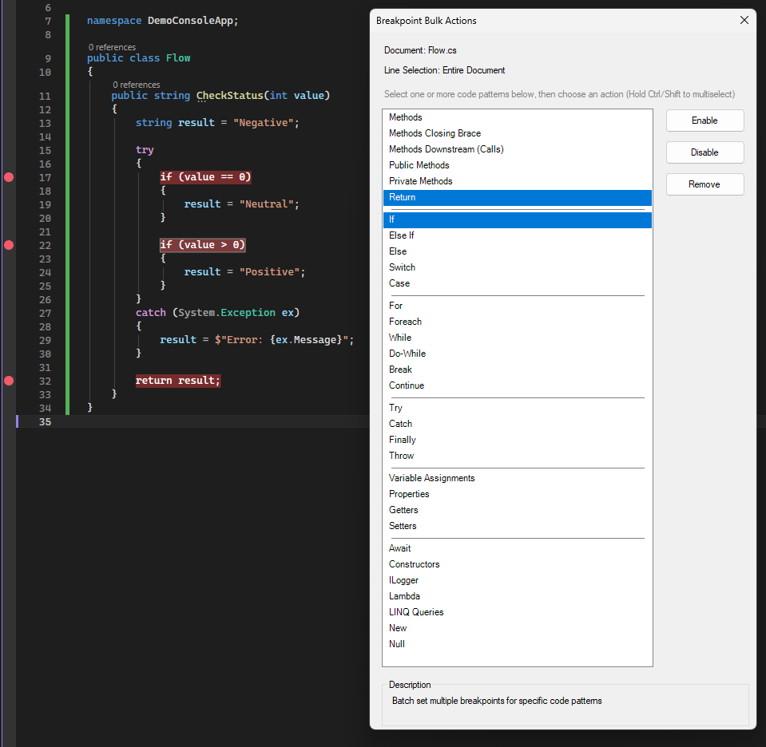
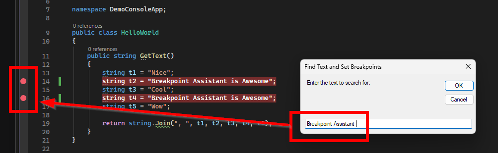
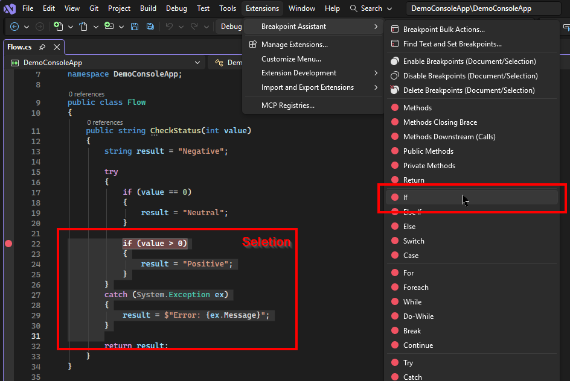
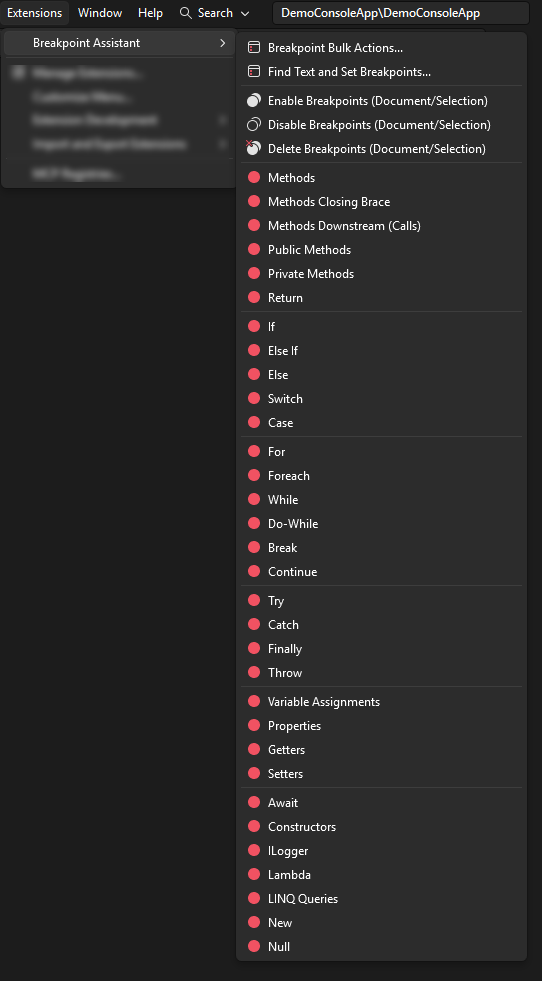
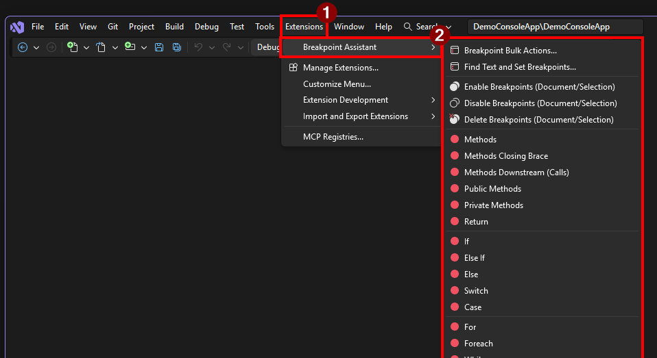
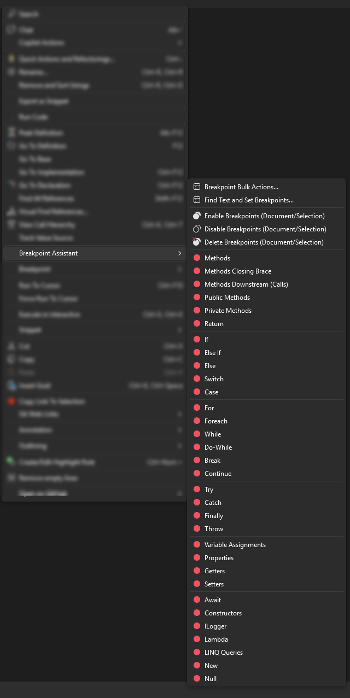
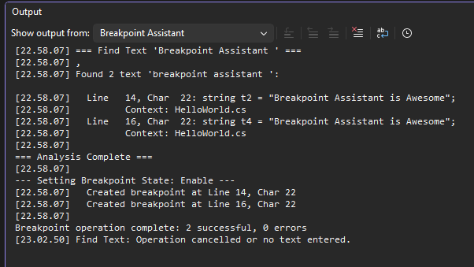

# Breakpoint Assistant - Visual Studio Extension

🎯**Accelerate debugging with bulk breakpoint automation**

A powerful Visual Studio extension that supercharges your debugging workflow by intelligently setting breakpoints on specific code patterns.

**Language Support:** 
- C#

---

## Breakpoint Bulk Actions
Interactive dialog to select multiple code patterns and set breakpoints in bulk:

**Breakpoint Bulk Actions - Screenshot:**

---

## Find Text And Set Breakpoint
Search for specific text and automatically place breakpoints on matching lines

---

## Works on Selected Text or Entire Document
Breakpoint Assistant can operate on either the entire document or just a selected portion of code, giving you flexibility in how you apply breakpoints.

**Example of Selected Text:**

---

# All Features

Breakpoint Assistant eliminates the tedious process of manually setting breakpoints by automatically finding and marking specific code patterns in your C# files. Simply select a code pattern type, and the extension does the rest.

**Screenshot:** 

### 🎯 Quick Access Tools

- **Breakpoint Bulk Actions** - Interactive dialog to select multiple code patterns and set breakpoints in bulk
- **Find Text and Set Breakpoints** - Search for specific text and automatically place breakpoints on matching lines

### 🔄 Breakpoint Management

- **Enable Breakpoints** - Enable all breakpoints in the current document or selected text
- **Disable Breakpoints** - Disable all breakpoints in the current document or selected text  
- **Delete Breakpoints** - Remove all breakpoints in the current document or selected text

### 📍 Methods & Functions

- **Methods** - Set breakpoints at the first line of all method declarations
- **Methods Closing Brace** - Set breakpoints at the closing brace of all methods (useful for tracking method exits)
- **Methods Downstream (Calls)** - Set breakpoints on method invocations
- **Public Methods** - Target only public method declarations
- **Private Methods** - Target only private method declarations
- **Return** - Set breakpoints on all return statements

### 🔀 Conditional Logic

- **If** - Set breakpoints on all if statement conditions
- **Else If** - Set breakpoints on all else if conditions
- **Else** - Set breakpoints on else blocks
- **Switch** - Set breakpoints on switch statements
- **Case** - Set breakpoints on case labels

### 🔁 Loops

- **For** - Set breakpoints on for loop declarations
- **Foreach** - Set breakpoints on foreach loop declarations
- **While** - Set breakpoints on while loop conditions
- **Do-While** - Set breakpoints on do-while loops
- **Break** - Set breakpoints on break statements
- **Continue** - Set breakpoints on continue statements

### ⚠️ Exception Handling

- **Try** - Set breakpoints on try block entries
- **Catch** - Set breakpoints on catch block entries
- **Finally** - Set breakpoints on finally block entries
- **Throw** - Set breakpoints on throw statements

### 🏷️ Properties & Variables

- **Variable Assignments** - Set breakpoints on all variable assignment statements
- **Properties** - Set breakpoints on property declarations
- **Getters** - Set breakpoints on property get accessors
- **Setters** - Set breakpoints on property set accessors

### 🚀 Advanced Features

- **Await** - Set breakpoints on all await expressions (async code debugging)
- **Constructors** - Set breakpoints on constructor declarations
- **ILogger** - Set breakpoints on logging statements
- **Lambda** - Set breakpoints on lambda expressions
- **LINQ Queries** - Set breakpoints on LINQ query expressions
- **New** - Set breakpoints on object instantiation (new keyword)
- **Null** - Set breakpoints on null checks and null assignments

---

## How to Use

### Method 1: Extensions Menu
1. Open any C# code file
2. Optionally select a range of code
3. Go to **Extensions** > **Breakpoint Assistant**
4. Select the desired feature from the submenu
5. View results in the **Breakpoint Assistant** Output window

---

### Method 2: Context Menu (Right-Click)
1. Open any C# code file
2. Optionally select a range of code
3. Right-click in the editor
4. Choose **Breakpoint Assistant** from the context menu
5. Select the desired feature

---

### Output Window
All results and logs are written to the **Breakpoint Assistant** pane in the Visual Studio Output window.

**To view:**
1. Go to **View** > **Output** (Ctrl+Alt+O)
2. Select **"Breakpoint Assistant"** from the dropdown

---

## Installation

1. Click **Extensions** > **Manage Extensions**
2. Search for **Breakpoint Assistant**
3. Click **Install**
4. Restart Visual Studio

### System Requirements
- Visual Studio 2022 (version 17.0 or higher)
- .NET Framework 4.7.2 or higher

# License

MIT
